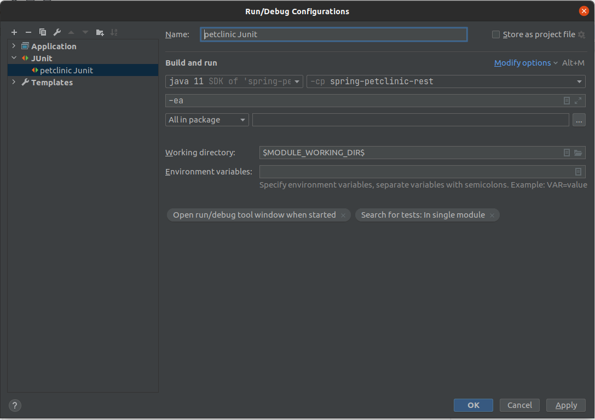

# REST version of Spring PetClinic

Infotiv's project for IT-Högskolan's test automation course 2021 


This backend version of the Spring Petclinic application only provides a REST API. **There is no UI**.
The [spring-petclinic-angular project](https://github.com/spring-petclinic/spring-petclinic-angular) is a Angular front-end application which consumes the REST API.

## Understanding the Spring Petclinic application with a few diagrams

[See the presentation of the Spring Petclinic Framework version](http://fr.slideshare.net/AntoineRey/spring-framework-petclinic-sample-application)


You can then access petclinic here: [http://localhost:9966/petclinic/](http://localhost:9966/petclinic/)

## Swagger REST API documentation presented here (after application start):
[http://localhost:9966/petclinic/swagger-ui.html](http://localhost:9966/petclinic/swagger-ui.html)

## Working with petclinic in terminal (Linux)

```
git clone https://github.com/spring-petclinic/spring-petclinic-rest.git
cd spring-petclinic-rest
./mvnw spring-boot:run
```

## Working with Petclinic in intelliJ IDEA
After opening the project, in the project tab -> src/main/java/PetClientApplication -> right click and run .. main()

```
Run -> Edit configuration -> in "Run/Debug configuration" add two configurations by pressing "+" ->  Junit -> "The type of resources that search for test" : "All in package" -> Apply, OK
```


Now there has to be two run profiles:
- Application: for running the server
- JUnit: for running test suite


## Working with Petclinic in Eclipse/STS

### prerequisites
The following items should be installed in your system:
* Maven 3 (https://maven.apache.org/install.html)
* git command line tool (https://help.github.com/articles/set-up-git)
* Eclipse with the m2e plugin (m2e is installed by default when using the STS (http://www.springsource.org/sts) distribution of Eclipse)

Note: when m2e is available, there is an m2 icon in Help -> About dialog.
If m2e is not there, just follow the install process here: http://eclipse.org/m2e/download/


### Steps:

1) In the command line
```
git clone https://github.com/spring-petclinic/spring-petclinic-rest.git
```
2) Inside Eclipse
```
File -> Import -> Maven -> Existing Maven project
```


## Screenshot of the Angular client


### Petclinic ER Model


## Security configuration
In its default configuration, Petclinic doesn't have authentication and authorization enabled.

### Basic Authentication
In order to use the basic authentication functionality, turn in on from the application.properties file
```
petclinic.security.enable=true
```
This will secure all APIs and in order to access them, basic authentication is required.
Apart from authentication, APIs also require authorization. This is done via roles that a user can have.
The existing roles are listed below with the corresponding permissions
* OWNER_ADMIN -> OwnerController, PetController, PetTypeController (getAllPetTypes and getPetType), VisitController
* VET_ADMIN   -> PetTypeController, SpecialityController, VetController
* ADMIN       -> UserController

There is an existing user with the username `admin` and password `admin` that has access to all APIs.
In order to add a new user, please use the following API:
```
POST /api/users
{
    "username": "secondAdmin",
    "password": "password",
    "enabled": true,
    "roles": [
    	{ "name" : "OWNER_ADMIN" }
	]
}
```

## Looking for something in particular?

| Layer | Source |
|--|--|
| REST API controllers | [REST folder](src/main/java/org/springframework/samples/petclinic/rest) |
| Service | [ClinicServiceImpl.java](src/main/java/org/springframework/samples/petclinic/service/ClinicServiceImpl.java) |
| JDBC | [jdbc folder](src/main/java/org/springframework/samples/petclinic/repository/jdbc) |
| JPA | [jpa folder](src/main/java/org/springframework/samples/petclinic/repository/jpa) |
| Spring Data JPA | [springdatajpa folder](src/main/java/org/springframework/samples/petclinic/repository/springdatajpa) |
| Tests | [AbstractClinicServiceTests.java](src/test/java/org/springframework/samples/petclinic/service/AbstractClinicServiceTests.java) |

